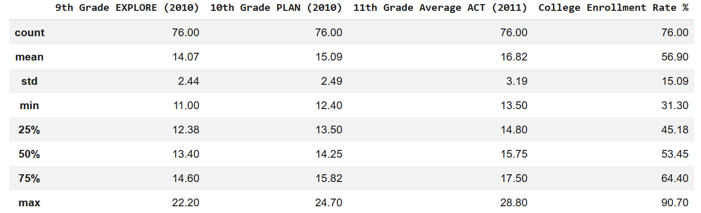
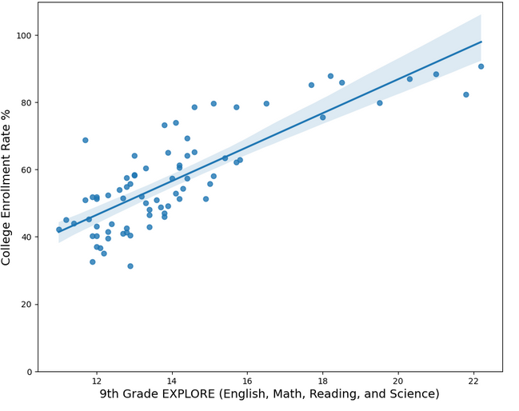
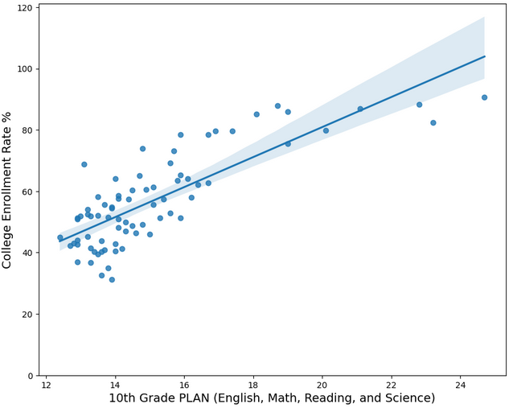
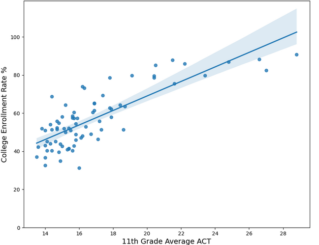

# Chicago High School Academic Performance and College Enrollment Analysis

This repository contains Python code to analyze the relationship between academic achievement in high school (specifically 9th-grade EXPLORE, 10th-grade PLAN, and 11th-grade ACT scores) and college enrollment rates for public high schools in Chicago.

## Project Overview
The goal of this project is to determine how early standardized test scores correlate with the likelihood of high school students enrolling in college. Using data from 2010-2011, this analysis identifies trends and predictive strengths of early assessments on final enrollment outcomes.

## Data Source
The analysis utilizes a dataset of Chicago public high schools, focusing on academic performance metrics from `Chicago_data.csv`.

## Tech Stack
* Python
* pandas
* numpy
* matplotlib
* seaborn
* scikit-learn

## Methodology

### 1. Data Cleaning
* **Filtering:** Focused only on high schools (`'Elementary, Middle, or High School' == 'HS'`). There were 93 high schools. 
* **Variable Selection:** Selected 9th Grade EXPLORE, 10th Grade PLAN, 11th Grade ACT, and College Enrollment Rate.
* **Handling Missing Values:** Replaced 'NDA' strings with `NaN` and dropped rows with missing data. 17 schools were dropped due to missing data. 
* **Data Typing:** Converted data types to `float` for numerical analysis.

### 2. Regression Analysis
A multiple linear regression model was trained to predict `College Enrollment Rate %` based on the three test scores.
* **Independent Variables (X):** 9th Grade EXPLORE, 10th Grade PLAN, 11th Grade ACT.
* **Dependent Variable (Y):** College Enrollment Rate %.

### 3. Visualization
Visualized the bivariate relationship between each test score and the college enrollment rate using `seaborn.regplot` to identify trends and linear fit.

## Data Insights (Descriptive Statistics)
Based on the analysis of **76 schools**:
* **Average Enrollment:** The average college enrollment rate is **56.9%**.
* **Average Scores of the Assessments**
  * EXPLORE (9th grade): **14.07**
  * PLAN (10th grade): **15.09**
  * ACT (11th grade): **16.82**
* **Variability:** The 11th-grade ACT scores show the highest standard deviation (**3.19**), indicating greater disparity in performance among schools by junior year compared to 9th grade (**2.44**).

### Assessment Benchmarks
For context, these assessments have the following maximum possible scores:
* **EXPLORE (9th Grade):** Maximum score of **25**.
* **PLAN (10th Grade):** Maximum score of **32**.
* **ACT (11th Grade):** Maximum score of **36**.

## Key Findings
* **Model Accuracy ($R^2$):** The regression model achieved an R-square of **0.67**, indicating that 67% of the variance in college enrollment rates can be explained by these test scores.
* **Trend Analysis:** The scatter plots show a strong positive relationship between test scores and enrollment rates across all three grade levels.

